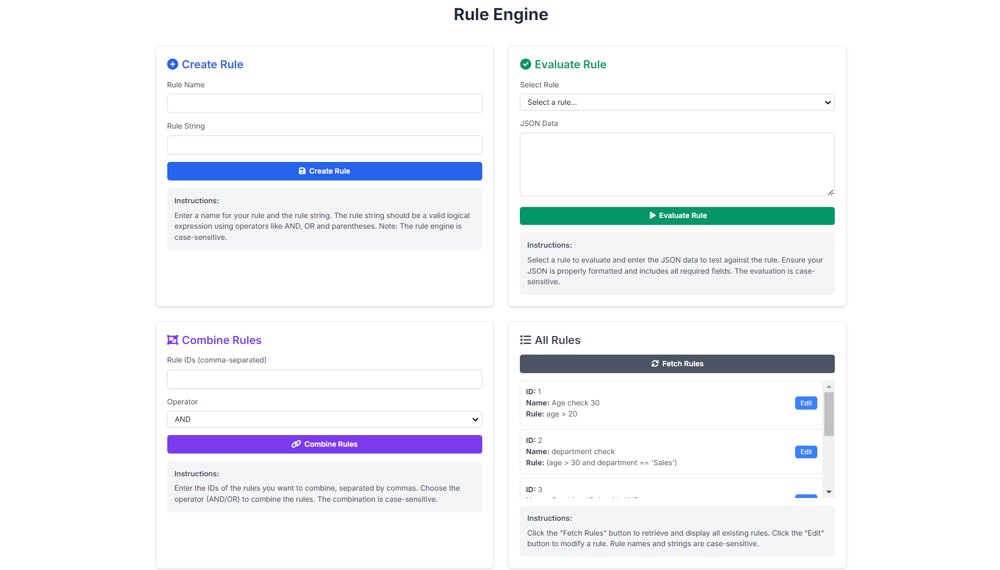

# Rule Engine with Abstract Syntax Tree (AST)

## Introduction

This project implements a sophisticated 3-tier rule engine application utilizing Flask, SQLAlchemy, and Abstract Syntax Tree (AST) to determine user eligibility based on various attributes like age, department, income, and spending. The system allows for dynamic creation, combination, and evaluation of conditional rules, providing an intuitive and efficient solution for complex decision-making scenarios.

## Key Features

- **Rule Creation**: Define individual rules using simple expressions.
- **Rule Combination**: Seamlessly combine multiple rules using logical operators (AND, OR).
- **Rule Evaluation**: Evaluate rules against user-defined data to check for eligibility.
- **Persistent Storage**: Store rules and their combinations in an SQLite database for future retrieval.
- **RESTful API**: Manage and evaluate rules through a REST API.
- **Web Interface**: User-friendly web interface for rule creation, combination, and evaluation.
- **Comprehensive Unit Testing**: Ensure system reliability and accuracy with a robust test suite.
- **Security Measures**: Strong input validation and secure API communication using CORS and SQLAlchemy to mitigate injection risks.

## Project Structure

```
rule-engine-ast/
│
├── api_server/            # Contains the backend API logic
│   ├── app.py             # Main Flask application setup
│   ├── config.py          # Flask configuration file
│   ├── models.py          # Database models using SQLAlchemy
│   ├── rules.py           # Core logic for creating, combining, and evaluating rules
│   └── templates/         # HTML templates for the web interface
│       └── index.html     # Web UI for interacting with the rule engine
│
├── tests/                 # Unit tests for the API and rule engine
│   └── test_rules.py
│
├── requirements.txt       # Python dependencies
└── README.md              # Project documentation
```

## Technologies Used

- **Backend**: Python 3.x, Flask, SQLAlchemy
- **Frontend**: HTML5, Tailwind CSS, JavaScript
- **Database**: SQLite
- **Testing**: unittest
- **Version Control**: Git

## Installation and Setup

### Prerequisites

Ensure you have Python 3.x installed and accessible from your system path.

### Installation Steps

1. Clone the repository:
   ```bash
   git clone https://github.com/lathifshaik/Rule-Engine-with-AST.git
   cd Rule-Engine-with-AST
   ```

2. Create and activate a virtual environment:
   ```bash
   python -m venv venv
   source venv/bin/activate  # On Windows, use `venv\Scripts\activate`
   ```

3. Install the required packages:
   ```bash
   pip install -r requirements.txt
   ```

4. Run the Flask application:
   ```bash
   flask run
   ```

The app will be running at http://localhost:5000.

## Configuration

The `config.py` file contains settings for the Flask application, such as the database connection string, secret keys, and debug mode options.

Key settings:
- `SQLALCHEMY_DATABASE_URI`: Path to the SQLite database.
- `SECRET_KEY`: Secret key for session management.
- `DEBUG`: Enable or disable Flask's debug mode.

## Rule Syntax and AST Implementation

We use a custom Node-based AST (Abstract Syntax Tree) structure to represent and process rules. Each rule is parsed into an AST, allowing for dynamic manipulation and evaluation.

### Supported Operations

- **Comparison Operators**: >, <, >=, <=, ==, !=
- **Logical Operators**: AND, OR
- **Nested Rules**: Complex rules using parentheses for grouping logic.

Example Rule:
```
(age > 30 AND department == 'Sales') OR (age < 25 AND department == 'Marketing')
```

## API Endpoints

- **Create Rule** (POST /create_rule):
  - Creates a rule and stores it in the database.
  - Request Body: `{"name": "Rule Name", "rule_string": "age > 25 AND department == 'Sales'"}`

- **Evaluate Rule** (POST /evaluate_rule/<rule_id>):
  - Evaluates a rule against provided user data.
  - Request Body: `{"age": 30, "department": "Sales", "salary": 55000}`

- **Combine Rules** (POST /combine_rules):
  - Combines multiple rules into one using a logical operator.
  - Request Body: `{"rule_ids": [1, 2], "operator": "AND"}`

- **List All Rules** (GET /rules):
  - Retrieves a list of all rules stored in the system.

- **Edit Rule** (PUT /edit_rule/<rule_id>):
  - Updates an existing rule.
  - Request Body: `{"rule_string": "age >= 18 AND department == 'Marketing'"}`

## Web Interface

The application provides an intuitive web interface for users to interact with the rule engine. Users can create, combine, and evaluate rules via the interface at http://localhost:5000.
<<<<<<< HEAD
=======

>>>>>>> 8bc97782d26abb6704a1de886e87b955f0b382c5

## Running Tests

To run the test suite, which covers rule creation, combination, and evaluation:

```bash
python -m unittest discover tests
```

Our tests ensure the rule engine behaves as expected, including edge cases and input validation.

## Security and Best Practices

- **Input Validation**: User inputs are validated to prevent injection attacks.
- **CORS**: Configured to restrict access from unauthorized domains.
- **SQL Injection Prevention**: SQLAlchemy ORM prevents SQL injection attacks.
- **Secret Key**: A strong secret key ensures secure session management.

## Troubleshooting

- **Database errors**: Ensure your SQLite file has the correct permissions and path.
- **Module not found errors**: Verify that all dependencies are installed correctly.
- **API call failures**: Check server logs for detailed error messages.

## Conclusion

This project implements a versatile and powerful rule engine capable of handling complex decision-making logic with ease. The flexible AST-based structure and seamless integration between the frontend, backend, and database make it ideal for real-world applications requiring dynamic rule creation, modification, and evaluation.
